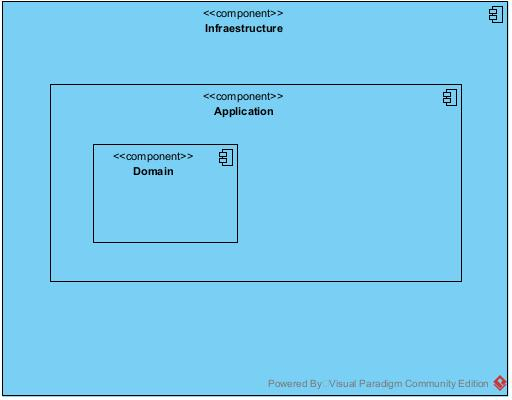

# SCF (sistema de Cortes de Fibra)


## Arquitectura

- onion Architecture
    - models (entities)
    - core (database, middlewares)
    - application (uc, dto, mapper)
    - infra (controller )

```text
src/
├── __init__.py
├── application/
├── core/
│   ├── __init__.py
│   └── middlewares/
├── infraestructure/
│   ├── conrollers/
│   └── repositories/
└── models/
    └── __init__.py
```

## Diagramas



## Features

- autenticación de usuarios 
- registro de usuarios
- CRUD de eventos
- CRUD de centrales
- notificaciones
