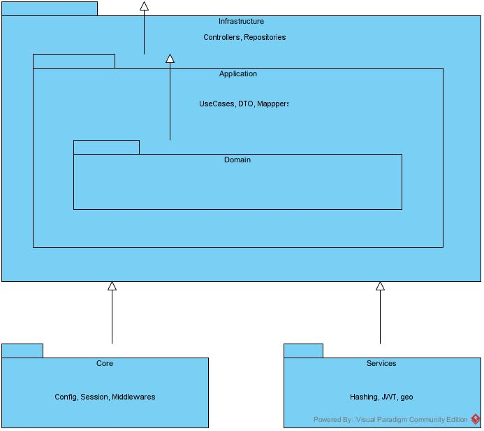
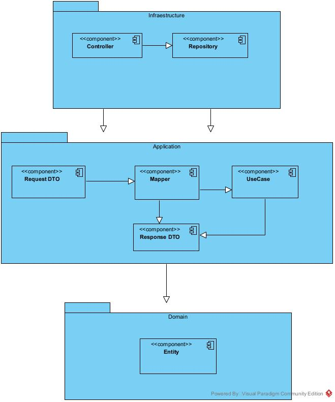

# Arquitectura

SCF sigue **Onion Architecture**, organizada en tres capas concéntricas más dos módulos transversales.

## Diagrama de arquitectura

## Capas

### `domain/`
La capa más interna. No depende de ninguna otra capa del proyecto.

- **`models/`**: entidades SQLAlchemy (persistencia). Definen la estructura real de las tablas.
- **`schemas/`**: contratos de entrada (Pydantic). Validan lo que la API recibe antes de que llegue a cualquier lógica de negocio.

### `application/`
Depende únicamente de `domain/`.

- **`usecases/`**: orquestación y reglas de negocio. Cada caso de uso es una clase con un único método `execute()`. Aquí viven las validaciones que no son de formato (ej. "el prefijo de una central debe ser único"), a diferencia de las validaciones de formato, que viven en los `schemas`.
- **`dtos/`**: contratos de salida (Pydantic). Definen exactamente qué campos se exponen al cliente — nunca se devuelve un `model` de SQLAlchemy directamente.
- **`mappers/`**: la única capa que traduce entre `Schema → Model` (al recibir) y `Model → DTO` (al responder). Ningún otro lugar del código hace esta conversión.

### `infrastructure/`
La capa más externa. Depende de `application/` y `domain/`.

- **`controllers/`**: endpoints FastAPI. Su única responsabilidad es parsear el request, instanciar el `Repository` y el `UseCase` correspondiente, y devolver la respuesta mapeada. No contienen lógica de negocio ni manejo de errores explícito (ver `authentication.md` y la sección de manejo de errores más abajo).
- **`repositories/`**: acceso a datos vía SQLAlchemy. Reciben y devuelven directamente el `Model` — no hay una capa de interfaces/ABC para repositorios en este proyecto (ver [ADR 002](decisions/002-clean-architecture.md)). No contienen reglas de negocio: si un registro no existe, el `Repository` regresa `None`; es el `UseCase` quien decide que eso es un `NotFoundError`.

## Módulos transversales

### `core/`
Configuración e infraestructura compartida por toda la aplicación:
- `config.py`: variables de entorno (Pydantic Settings).
- `session.py` / `init_db.py`: conexión a base de datos y creación automática de tablas al arrancar.
- `middlewares/`: `auth_middleware.py` (JWT), `role_middleware.py` (autorización por rol).
- `exceptions.py` / `exception_handlers.py`: jerarquía de excepciones de negocio y su mapeo centralizado a códigos HTTP.
- `rate_limiter.py`: configuración de `slowapi`.

### `services/`
Utilidades técnicas reutilizables entre capas, sin estado de negocio: hashing de contraseñas, JWT, generación de códigos de técnico, cálculo geográfico, S3, WhatsApp, OneSignal.

## Implementación del patrón DTO

El request entra como `Schema` (validación de formato), el `Mapper` lo convierte a `Model` para que el `UseCase` opere sobre él, y al responder el mismo `Mapper` convierte el `Model` resultante a `DTO` — así el cliente nunca recibe la fila completa de la base de datos, solo los campos que el `DTO` define explícitamente.

## Manejo de errores

- `core/exceptions.py` define `AppError` y sus subclases (`NotFoundError`, `ConflictError`, `ForbiddenError`, `ValidationError`).
- `core/exception_handlers.py` mapea cada excepción a su código HTTP correspondiente, registrado globalmente en `main.py`.
- `ErrorHandlingMiddleware` captura cualquier excepción no prevista (fuera del ciclo normal de FastAPI) y responde `500` sin exponer detalles internos al cliente, mientras registra el traceback en logs.
- Excepción deliberada: `InvalidCredentialsError` (login) no hereda de `AppError` porque un 401 de credenciales inválidas es semánticamente distinto de los errores de negocio genéricos.