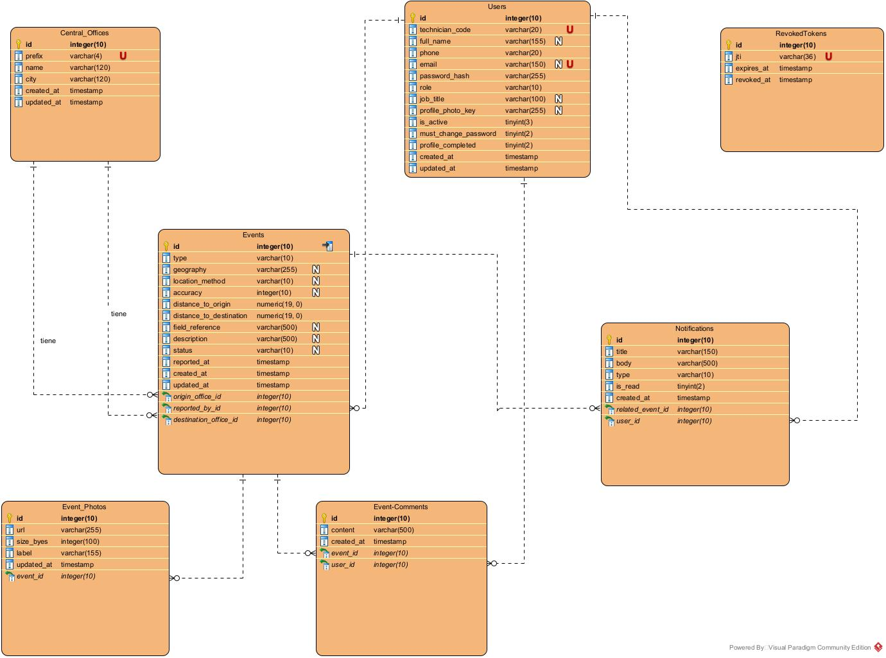

# Base de datos

PostgreSQL + PostGIS. Ver [ADR 001](decisions/001-use-postgresql.md) para el razonamiento de esta elección.

## Diagrama entidad-relación



## Creación de tablas

Las tablas se crean automáticamente al levantar la API, dentro del `lifespan` de FastAPI (`core/init_db.py`):

```python
async def init_db() -> None:
    async with engine.begin() as conn:
        await conn.execute(text("CREATE EXTENSION IF NOT EXISTS postgis"))
        await conn.run_sync(Base.metadata.create_all)
```

**Limitación conocida:** `create_all` solo crea tablas/columnas que no existen; no altera columnas de tablas ya creadas. Cambios de esquema sobre tablas existentes requieren recrearlas manualmente en desarrollo (`DROP TABLE ... CASCADE`) hasta que se incorpore un sistema de migraciones formal (Alembic, pendiente).

## Cálculo de distancias

Las distancias entre un evento y sus centrales de origen/destino se calculan en el momento de creación, vía PostGIS:

```sql
SELECT ST_Distance(location, ST_SetSRID(ST_MakePoint(:lon, :lat), 4326)) / 1000.0
FROM central_offices WHERE id = :office_id;
```

Es distancia geográfica en línea recta (no ruta física de fibra). Ver decisión original en la sección 11 del documento de diseño inicial del proyecto.

## Pendientes

- Migraciones formales con Alembic.
- Limpieza periódica de `revoked_tokens` (método `purge_expired()` ya existe en el repository, sin scheduler conectado).